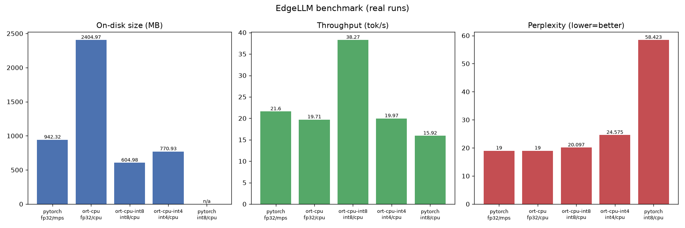

# EdgeLLM

**Quantize a small language model and run it on-device — CPU, GPU, mobile, and a Qualcomm Snapdragon NPU — with a C/C++ inference harness and a rigorous, honestly-measured benchmark suite.**

This is a portfolio project built around the requirements of a Qualcomm *Machine Learning Engineer (AI Research, GenAI for the Edge)* role. Every latency, throughput, memory, size, and accuracy number in this README comes from an **actual run** on real hardware. Steps that require hardware or credentials I have not yet wired up are shown as clearly-labeled `TODO(vijay): run on <device>` placeholders — never invented.

> Status: **Phase 4 complete** (C++ ONNX Runtime inference harness). Phases 5–8 in progress.

---

## What it does (target)

- Load a small instruct LLM (default **Qwen2.5-0.5B-Instruct**, swappable) and generate text.
- Export to **ONNX** and benchmark an FP32 baseline: latency, tokens/sec, peak RAM, on-disk size, perplexity.
- **Quantize** to INT8 (PyTorch + ONNX Runtime) and INT4 (GPTQ/AWQ, or GGUF fallback), and compare all precisions.
- Run inference from a **C++17** harness via the ONNX Runtime C++ API.
- Profile on a real **Qualcomm Snapdragon NPU** via Qualcomm AI Hub / the ONNX Runtime QNN Execution Provider.
- Optional stretch: a custom SIMD INT8 GEMM kernel and an Android on-device app.

## Requirement → feature mapping

| Qualcomm JD requirement | Where it shows up in EdgeLLM |
| --- | --- |
| Python, PyTorch, deep learning, GenAI | `edgellm/models.py`, `edgellm/runners.py` (Phase 1) |
| Model optimization / on-target deployment | ONNX export + benchmark harness (Phase 2) |
| Neural-network model optimization (quantization) | `edgellm/quantize.py` INT8/INT4 (Phase 3) |
| C/C++; analytical/debugging | `cpp/` ONNX Runtime C++ harness (Phase 4) |
| NPUs / ML accelerators | `aihub/`, QNN EP runner (Phase 5) |
| Usability, SW design, communication | CLI, config, CI, this README (Phase 0/6) |
| Optimization of algebraic ops for HW cores | `kernels/` SIMD INT8 GEMM (Phase 7, optional) |
| Android, on-device inference | `android/` ORT Mobile app (Phase 8, optional) |

## Benchmark results

Real numbers are filled in as each phase runs. Nothing here is invented.

**Model:** Qwen/Qwen2.5-0.5B-Instruct · **Machine:** Apple Silicon (arm64), macOS · **Workload:** 64 new tokens, greedy, warmup 2 / measured 5 · **Perplexity:** WikiText-2 (32-line slice, 512-token windows).

| Backend | Precision | Device | Size (MB) | Latency (s) | Throughput (tok/s) | Peak RAM (MB) | Perplexity |
| --- | --- | --- | --- | --- | --- | --- | --- |
| pytorch | fp32 | mps | 942.32 | 2.96 ± 0.02 | 21.60 | 2495.7 | 19.00 |
| ort-cpu | fp32 | cpu | 2404.97 | 3.25 ± 0.09 | 19.71 | 2910.8 | 19.00 |
| **ort-cpu** | **int8** | **cpu** | **604.98** | **1.67 ± 0.04** | **38.27** | **2861.8** | **20.10** |
| ort-cpu | int4 | cpu | 770.93 | 3.21 ± 0.07 | 19.97 | 3194.2 | 24.58 |
| pytorch | int8 | cpu | n/a¹ | 4.02 ± 0.08 | 15.92 | 5396.5 | 58.42 |
| ort-qnn | int8 | Snapdragon NPU | _TODO(vijay): run on Snapdragon (Phase 5)_ | _TODO_ | _TODO_ | _TODO_ | _TODO_ |



**What the numbers actually say (all measured on this machine):**
- **ONNX Runtime INT8 is the clear win:** **4× smaller** than the FP32 ONNX model (605 vs 2405 MB) and **~2× faster** (38.3 vs 19.7 tok/s) while perplexity barely moves (19.0 → 20.1). ORT uses **per-channel** weight quantization, which preserves accuracy well.
- **Not all INT8 is equal:** PyTorch's *default dynamic* INT8 is **per-tensor** and (on ARM/qnnpack) ignores `reduce_range`, so its perplexity collapses to **58.4** — a concrete demonstration that quantization *scheme* matters as much as bit width. Kept in the table precisely to show the failure mode honestly rather than hide it.
- **INT4's size doesn't beat INT8 here (770 vs 605 MB)** — the "small model, huge vocab" effect: block-wise weight-only INT4 compresses the `MatMul` layers but not the ~544 MB FP32 token-embedding `Gather`, and the tied `lm_head` adds a 4-bit copy. Perplexity also degrades more (24.6). On a model with a smaller vocab-to-params ratio, INT4 wins on size; documented as a real, model-specific result.
- **Correctness anchor:** PyTorch and ORT FP32 give **identical perplexity (19.0)**, confirming the ONNX export is numerically faithful before any quantization.

¹ PyTorch dynamic INT8 is an in-memory transform with no standalone on-disk artifact, so size is n/a.
FP32 size note: the PyTorch row measures the hub's **bf16** `safetensors` (942 MB); the ONNX FP32 export is true **fp32** (2405 MB). The INT8/INT4 rows are the meaningful size comparison.

Reproduce: `edgellm quantize && edgellm benchmark && edgellm report` (writes `results/{benchmarks.json,benchmark.md,benchmark_chart.png}`).

---

## Quantization, in plain English (Phase 3)

Quantization stores weights (and sometimes activations) in fewer bits than FP32. The trade-off is size/speed vs. accuracy. EdgeLLM implements several schemes so they can be compared head-to-head:

**Bit width.** FP32 uses 32 bits/weight; **INT8** uses 8 (~4× smaller); **INT4** uses 4 (~8× smaller). Fewer bits = smaller and faster, but coarser, so accuracy (perplexity) can degrade.

**Symmetric vs. asymmetric.** A quantized weight is reconstructed as `w ≈ scale × q` (symmetric, zero maps to 0) or `w ≈ scale × (q − zero_point)` (asymmetric, an integer offset lets the range be lopsided). Symmetric is cheaper; asymmetric fits skewed distributions better.

**Per-tensor vs. per-channel vs. block-wise.** One `scale` for a whole tensor is cheapest but crude. **Per-channel** gives each output channel its own scale (much better for weights, tiny overhead). **Block-wise** (used for INT4 here) gives every contiguous block of `block_size` weights its own scale — the finer the blocks, the better the accuracy and the more scale overhead.

**Dynamic vs. static.** **Dynamic** quantization quantizes weights offline and computes activation scales *on the fly* per inference — no calibration data, robust, the default for LLMs. **Static** quantization pre-computes activation scales from a **calibration** set (a few representative batches), which is faster at run time but needs that data and is more sensitive.

**What runs where.** INT8 (PyTorch dynamic + ONNX Runtime dynamic) and INT4 (ONNX Runtime block-wise weight-only) all run on this CPU/Apple-Silicon machine. GPTQ/AWX-style INT4 typically needs CUDA and is unavailable here; `edgellm quantize` prints the honest per-backend availability. On the Snapdragon NPU (Phase 5), INT8 is the natively accelerated format.

**Note on this specific model.** Qwen2.5-0.5B has a large vocabulary (~152k), so its tied token-embedding / `lm_head` weight dominates the file. Weight-only quantization compresses the `MatMul` layers but not the embedding `Gather`, so INT4's on-disk size doesn't shrink as much as the 8× bit ratio suggests — a real, measured effect discussed with the numbers below.

Reproduce: `edgellm quantize` (build artifacts) then `edgellm benchmark` (measure all precisions).

---

## Setup

This project targets **Python 3.10–3.12**. (On this machine the default `python3` is 3.14, which the ML stack does not yet fully support, so the venv is built on Python 3.11.)

```bash
# From the repo root
python3.11 -m venv .venv
source .venv/bin/activate
pip install --upgrade pip
pip install -e ".[dev]"          # core + lint/test tooling
# Later phases: pip install -e ".[onnx,eval,report]"
```

## Usage

```bash
# Show the resolved model/device for this machine
edgellm info

# Generate text (downloads the model on first run)
edgellm generate --prompt "Explain what quantization is in one sentence."

# Deterministic / reproducible generation
edgellm generate -p "Write a haiku about edge AI." --greedy --max-new-tokens 48

# Export to ONNX (FP32), quantize to INT8/INT4, benchmark, and chart
edgellm export
edgellm quantize               # build INT8 + INT4 artifacts (prints backend availability)
edgellm benchmark              # all precisions; add --skip-ppl to skip perplexity
edgellm benchmark --only ort-int8,ort-int4   # subset
edgellm report                 # regenerate table + bar chart from results JSON

# Tokenizer boundary for the C++ harness
edgellm encode -p "Hello"      # -> token ids
edgellm decode --ids "..."     # ids -> text
```

## C++ inference harness (Phase 4)

`cpp/` is a C++17 CLI (`edgellm_infer`) that loads a quantized/FP32 ONNX model and runs **autoregressive greedy decoding with a KV cache** through the ONNX Runtime C++ API — the actual model inference lives in C++; tokenization/detokenization stay in Python (`edgellm encode` / `edgellm decode`). It self-configures by reading `config.json` (layers, KV heads, head dim).

```bash
# Prereqs (macOS): brew install cmake onnxruntime
cmake -S cpp -B cpp/build -DCMAKE_BUILD_TYPE=Release
cmake --build cpp/build

# End-to-end: tokenize -> C++ inference -> detokenize
IDS=$(edgellm encode -p "Explain what quantization is in one sentence.")
./cpp/build/edgellm_infer \
    --model artifacts/onnx/Qwen__Qwen2.5-0.5B-Instruct-int8-dynamic \
    --tokens "$IDS" --max-new-tokens 48
# copy the GENERATED_IDS line into:
edgellm decode --ids "<generated ids>"
```

On non-macOS, set `ORT_HOME` to an ONNX Runtime install (with `include/` and `lib/`) before `cmake`.

**Measured on this machine** (prompt = 39 tokens, 48 new tokens, greedy, KV cache; ORT CPU EP):

| Precision | Prefill (ms) | Decode (tok/s) | Overall (tok/s) |
| --- | --- | --- | --- |
| fp32 | 257 | 18.0 | 16.7 |
| **int8** | **66** | **69.9** | **65.0** |
| int4 | 219 | 22.9 | 21.1 |

INT8 decodes **~3.9× faster than FP32** in the C++ harness, and faster than the Python ORT wrapper (38 tok/s) thanks to lower per-step overhead. Output is verified coherent (e.g. *"Quantization is the process of reducing the number of bits used to represent a signal or data..."*).

## Development

```bash
ruff check .        # lint
black --check .     # format check
pytest              # tests
```

CI (GitHub Actions) runs all three on every push.

## License

[MIT](LICENSE) © 2026 Vijay Kapse
